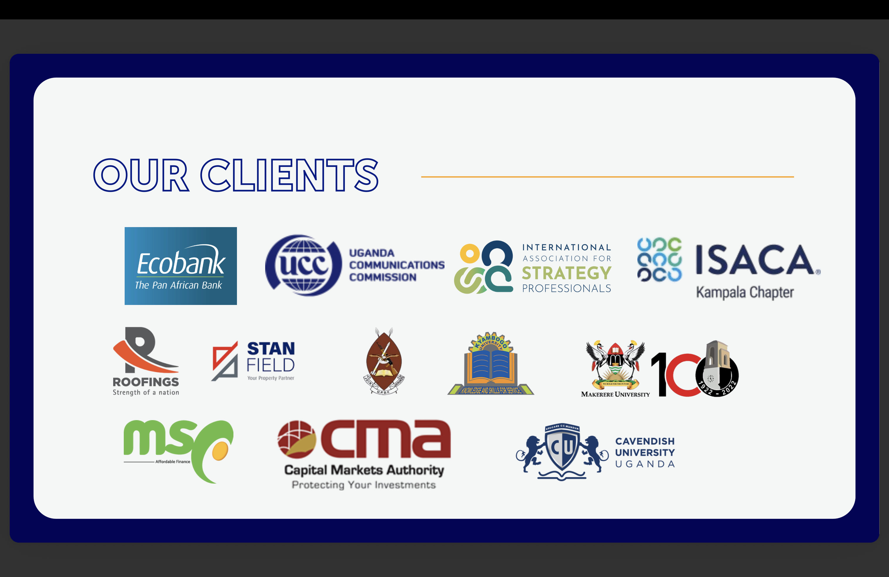
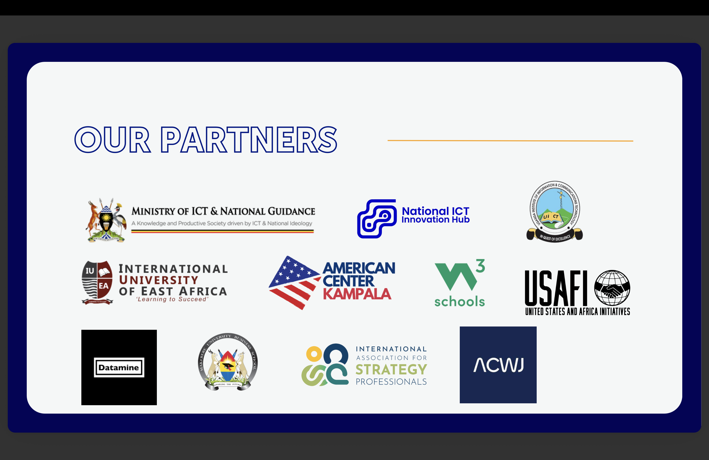

# 👋 Welcome to Otic Group

**A diversified AI powerhouse accelerating Africa’s digital transformation.**

Otic Group brings together Otic Technologies, Otic Foundation, Otic Rwanda, and Otic Institute of Emerging Technologies working as one to build a globally competitive, inclusive AI ecosystem from Uganda for the African continent.

---

## 🌟 Defining Our Purpose

### Vision
A thriving AI ecosystem in Uganda.

### Mission
To cultivate an inclusive, innovation-led AI ecosystem—laying the foundation for Uganda’s digital economy and equipping the workforce for the future of work and industry.

---

## 🔍 Focus Areas

### OTIC TECH
Otic Technologies is the innovation engine of Otic Group, delivering AI training solutions and outsourcing services that enhance workforce capabilities and drive digital efficiency for African enterprises and communities.

- **Corporate AI Consultancy & Training**: Empowering corporate organizations and the public sector to adopt and leverage AI for improved efficiency, decision-making, and innovation.
- **Digital Process Automation**: Helping organizations transform operations through intelligent automation and data-driven efficiency.
- **AI Talent Outsourcing & Staffing**: Connecting organizations with vetted AI and technology professionals to scale innovation faster.

#### Our Key Systems
- **[Otic Learn](https://oticlearn.com)** — Interactive learning platform
- **[Otic Vision](https://oticvision.com)** — AI-powered business platform

### OTIC FOUNDATION
Otic Foundation is the community-focused arm championing grassroots AI advocacy, digital inclusion, and equitable access to emerging technologies.

- National Free AI Skilling Initiative (NFASI)
- University AI Programs Advocacy

### OIET
A center for advanced learning and research in AI, data science, and frontier tech.

### OTIC RWANDA
Otic has expanded into Rwanda, providing services in enterprise skilling, AI business process outsourcing, grassroots AI literacy, and sector-specific certifications.

---

## 📈 Our Traction
- **Endorsement**: Official endorsement from the Government of Uganda as an AI implementor and educator.
- **Trained**: Over 5500 learners have passed through our programs.
- **Community**: Online community of over 15,000 AI talent and enthusiasts.
- **Beyond Borders**: Scaled beyond Uganda to Rwanda.

---

## 👥 Our Board
- **Daniel Reime** — Board Chair
- **Thomas Thorsell Arntsen** — Board Member
- **Kenneth Oduka** — Board Member
- **Yasmin Kayali** — Board Member
- **Abhishesh Pal** — Board Member

---

## 🤝 Our Clients & Partners

### Our Valued Clients

  

### Our Esteemed Partners

  

---

## 📫 Let's Work Together!
- 🌐 [Website](https://www.oticgroup.net)
- 📞 Phone: +256 756 722 263
- ✉️ Email: [info@oticgroup.net](mailto:info@oticgroup.net)

---

> *“We believe the future of technology in Africa will be built by Africans.”*
